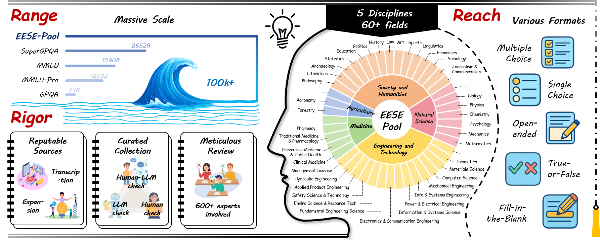

<div align="center">

    
 <div>
  <h1>The Ever-Evolving Science Exam</h1>

_What constitutes a good science benchmark?_


  <div>
      <a href="https://github.com/junyingwang959" target="_blank">Junying Wang</a><sup>*</sup>,
      <a href="https://zzc-1998.github.io/" target="_blank">Zicheng Zhang</a><sup>*</sup><sup>#</sup>,
      <a>Yijin Guo</a><sup>*</sup>,
      <a>Farong Wen</a><sup>*</sup>,
      <a>Ye Shen</a>,
      <a>Yingji Liang</a>,
  </div>

<div>
      <a>Yalun Wu</a>,
      <a>Wenzhe Li</a>,
      <a href="https://github.com/lcysyzxdxc" target="_blank">Chunyi Li</a>,
      <a href="https://zijianchen98.github.io/" target="_blank">Zijian Chen</a>,
      <a href="https://jiaqisjtu.github.io/" target="_blank">Qi Jia</a>,
      <a href="https://ee.sjtu.edu.cn/en/FacultyDetail.aspx?id=24&infoid=153&flag=153" target="_blank">Guangtao Zhai</a><sup>#</sup>,
  </div>
  <div>
  Shanghai Artificial Intelligence Laboratory
  </div>   
<div>
<sup>*</sup>Equal contribution. <sup>#</sup>Corresponding author. 
   </div>
    
<a href="https://arxiv.org/pdf/2507.16514"><strong>Paper</strong></a>  |
<a href="https://github.com/aiben-ch/EESE"><strong>Github</strong></a>  |
<a href="https://aiben.ch/"><strong>Team Work</strong></a> |
<a href="https://huggingface.co/datasets/AIBench/EESE"><strong>Huggingface</strong></a> 

  
    
 <div style="width: 80%; text-align: center; margin:auto;">
      
  </div>
</div>
 
</div>

## Release
- [2025/7/22]🔥  Our paper is submmitted online.

## key Contribution
- **A large-scale, high-quality science benchmark pool**: We construct EESE-Pool, a 100K+ science question-answer pair pool across 5 disciplines and 500+ subfields, with diverse formats and rigorous quality control. We design three-stage Data Engine (Transcription, Expansion, and Categorization) and Data Refinement (a Parallel Three-Branch Refinement Framework) to ensure range, reach, and rigor.
- **A dynamic, leakage-resilient evaluation set**: We propose EESE, a 500-instance subset periodically updated (regular resampling 500 instances from the EESE-Pool), maintaining representativeness while reducing leakage risk and evaluation overhead.
- **Comprehensive evaluation of LLMs**: We evaluate 32 leading models (open- and closed-source) on EESE-Pool and EESE, revealing significant performance gaps across disciplines, the effectiveness of refinement in improving quality, and the trade-offs between inference cost and science ability. The findings offer insights for future science benchmarks.

<div></div>

<div style="width: 95%; text-align: center; margin:auto;">
      
  </div>

## Quick Start

### 1. Install Dependencies

```bash
pip install -r requirements.txt
```

### 2. Configure API Keys

Edit `config.py` and replace the API keys:

```python
LLM_CONFIG = {
    "base_url": "https://api.openai.com/v1",
    "api_key": "your-actual-api-key-here",  # Replace with your API key
    "model": "model-name",
    "temperature": 0.0,
    "max_retries": 3
}

JUDGE_LLM_CONFIG = {
    "base_url": "https://api.openai.com/v1", 
    "api_key": "your-actual-api-key-here",  # Replace with your API key
    "model": "model-name",
    "temperature": 0.0,
    "max_retries": 3
}
```

### 3. Prepare Data

Ensure your `esee.jsonl` file is in the project directory. You can download from [Huggingface](https://huggingface.co/datasets/AIBench/EESE).


### 4. Run Evaluation

```bash
python main.py
```

## File Structure

```
├── main.py              # Main evaluation script
├── inference.py         # Core inference functions
├── config.py            # Configuration settings
├── call.py              # LLM API calling functions
├── llm_information.py   # LLM client setup
├── utils.py             # Utility functions
├── requirements.txt     # Python dependencies
├── EESE.jsonl           # Input data file
├── log/                 # Log files directory
└── results/             # Output results directory
```


## Output Files

After running the evaluation, you'll get:

1. **Log File** (`log/evaluation.log`): Detailed processing logs
2. **Detailed Results** (`results/detailed_results.json`): Complete evaluation data
3. **Summary Results** (`results/summary_results.json`): Performance summary by discipline


## Scoring System

- **Closed-ended questions**: 0 or 10 points (correct/incorrect)
- **Open-ended questions**: 0-10 points (integer scores)
- Scores are automatically generated by the judging LLM


## Contact

Please contact any of the first authors of this paper for queries.

- Zicheng Zhang, `zhangzicheng@pjlab.org.cn`, @zzc-1998
- Junying Wang, `wangjunying@pjlab.org.cn`, @junyingwang959


## Citation

If you find our work interesting, please feel free to cite our paper:

```bibtex
@misc{wang2025everevolvingscienceexam,
      title={The Ever-Evolving Science Exam}, 
      author={Junying Wang and Zicheng Zhang and Yijin Guo and Farong Wen and Ye Shen and Yingji Liang and Yalun Wu and Wenzhe Li and Chunyi Li and Zijian Chen and Qi Jia and Guangtao Zhai},
      year={2025},
      eprint={2507.16514},
      archivePrefix={arXiv},
      primaryClass={cs.CL},
      url={https://arxiv.org/abs/2507.16514}, 
}
```
